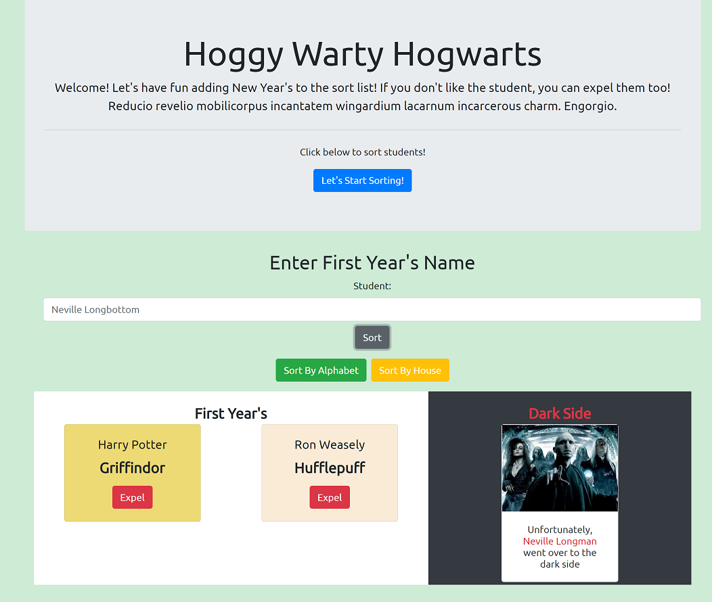

## Name of the Project
### Sorting Hat

## Overview of the project
Sorting Hat allows users to have fun adding New Year's students and assign random houses just like Harry Potter. Also it allows user to expel students who they don't like.

## Link to Chie's wireframes/prototype
No wireframes were used for this project.

## Link to the deployed project

<https://cs-sorting-hat.netlify.app/>

Link to the project board

<https://github.com/chiestroud/team-planning/projects>

## Description of the user
Any user

## List of features
* Show form on the DOM when user clicks "Let's Start Sorting!" button.
* Creates student cards when new students were entered.
* Students move to Dark Side when they are expelled.

## Screenshots of the project

## List of contributors and links to their GH profiles
<https://github.com/chiestroud>

## Link to Loom video walkthrough of the app
